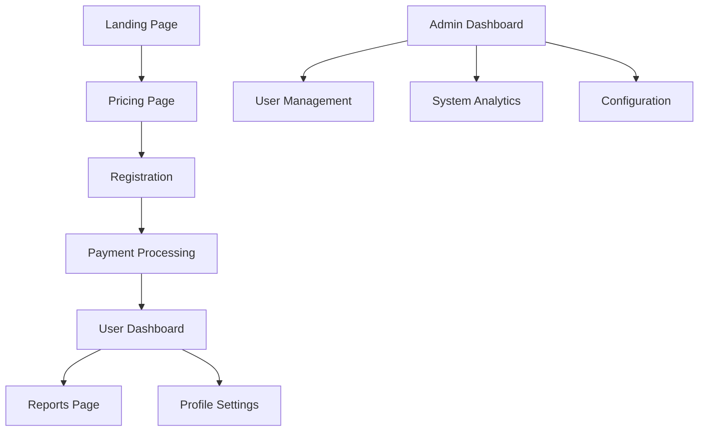

## 1. Product Overview
PaySSD v3.0 is a comprehensive payment processing platform upgrade that modernizes the existing system with React 18, Supabase backend, and Flutterwave payment gateway. This version maintains v2.0 live during development while building a fresh, scalable architecture with enhanced analytics, modern UI components, and robust authentication.

The platform serves businesses needing secure payment processing with multi-currency support, subscription management, and detailed financial reporting capabilities.

## 2. Core Features

### 2.1 User Roles
| Role | Registration Method | Core Permissions |
|------|---------------------|------------------|
| User | Email, Google, Facebook, Apple | View transactions, manage subscriptions, access reports |
| Admin | Admin invitation | Full system access, user management, analytics dashboard |

### 2.2 Feature Module
The payment platform consists of the following main pages:
1. **Landing page**: Hero section, feature highlights, testimonials, call-to-action
2. **Pricing page**: Subscription tiers, feature comparison, payment options
3. **Contact page**: Support form, contact information, help center links
4. **Compliance page**: Regulatory information, security certifications, privacy policy
5. **Reports page**: Transaction history, analytics dashboard, export functionality
6. **User Dashboard**: Transaction overview, subscription status, profile settings
7. **Admin Dashboard**: System analytics, user management, configuration settings

### 2.3 Page Details
| Page Name | Module Name | Feature description |
|-----------|-------------|---------------------|
| Landing page | Hero section | Display compelling value proposition with animated background |
| Landing page | Feature highlights | Showcase key payment capabilities with interactive cards |
| Landing page | Testimonials | Customer success stories with verified badges |
| Pricing page | Subscription tiers | Display monthly/annual pricing with currency toggle |
| Pricing page | Feature comparison | Detailed comparison table with hover effects |
| Pricing page | Payment options | Flutterwave integration for immediate signup |
| Contact page | Support form | Multi-step form with file upload capability |
| Contact page | Help center | Searchable FAQ with categorized topics |
| Compliance page | Security badges | Display PCI DSS and other certifications |
| Compliance page | Privacy policy | Interactive policy viewer with section navigation |
| Reports page | Transaction history | TanStack Table with sorting, filtering, pagination |
| Reports page | Analytics dashboard | Recharts visualization of key metrics |
| Reports page | Export functionality | CSV and PDF export with custom date ranges |
| User Dashboard | Transaction overview | Real-time transaction status with notifications |
| User Dashboard | Subscription status | Current plan details and upgrade options |
| User Dashboard | Profile settings | Personal information and security settings |
| Admin Dashboard | System analytics | Revenue metrics, user growth charts |
| Admin Dashboard | User management | User table with role assignment |
| Admin Dashboard | Configuration | System settings and webhook management |

## 3. Core Process
**User Flow:**
1. Visitor lands on homepage and explores features/pricing
2. User registers via email or social login (Google/Facebook/Apple)
3. User completes Flutterwave payment to activate subscription
4. User accesses dashboard to view transactions and manage account
5. System sends webhook notifications for payment events
6. User can generate reports and export financial data

**Admin Flow:**
1. Admin logs in with elevated privileges
2. Admin monitors system-wide analytics and KPIs
3. Admin manages user accounts and subscriptions
4. Admin configures payment settings and webhook endpoints
5. Admin generates compliance reports and system audits

## 4. User Interface Design

### 4.1 Design Style
- **Primary Colors**: Modern blue gradient (#3B82F6 to #1E40AF) with emerald accents (#10B981)
- **Secondary Colors**: Neutral grays (slate palette) for professional appearance
- **Button Style**: Rounded corners (8px radius) with subtle shadows and hover effects
- **Typography**: Inter font family with responsive sizing (14px base, 16px for body)
- **Layout Style**: Card-based design with consistent spacing (8px grid system)
- **Icons**: Heroicons for consistency, with custom payment gateway icons
- **Animations**: Smooth transitions (200-300ms) and micro-interactions

### 4.2 Page Design Overview
| Page Name | Module Name | UI Elements |
|-----------|-------------|-------------|
| Landing page | Hero section | Full-width gradient background with animated particles, centered headline with typewriter effect |
| Pricing page | Subscription tiers | Three-column responsive grid with featured plan highlight, toggle switch for monthly/annual |
| User Dashboard | Transaction overview | Data table with status badges, search bar, date picker, action dropdowns |
| Admin Dashboard | System analytics | Multi-chart dashboard with KPI cards, real-time updates via WebSocket |
| Reports page | Analytics dashboard | Interactive charts with zoom/pan, export buttons, filter sidebar |

### 4.3 Responsiveness
- **Desktop-first approach** with mobile optimization
- **Breakpoints**: 640px (mobile), 768px (tablet), 1024px (desktop)
- **Touch optimization** for mobile payment flows
- **Progressive enhancement** for older browsers
- **Performance budget** maintained across all devices