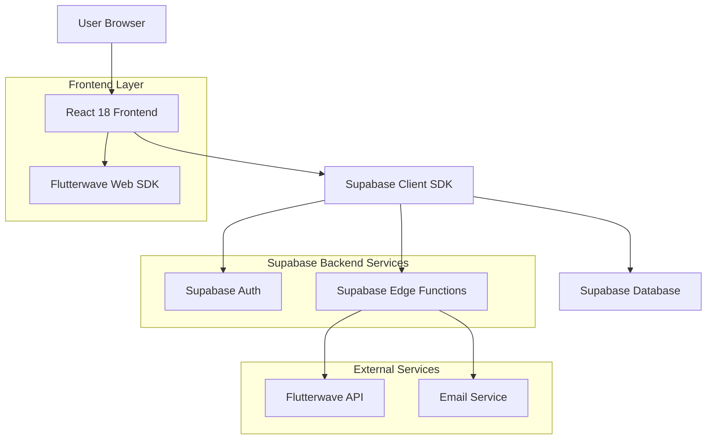
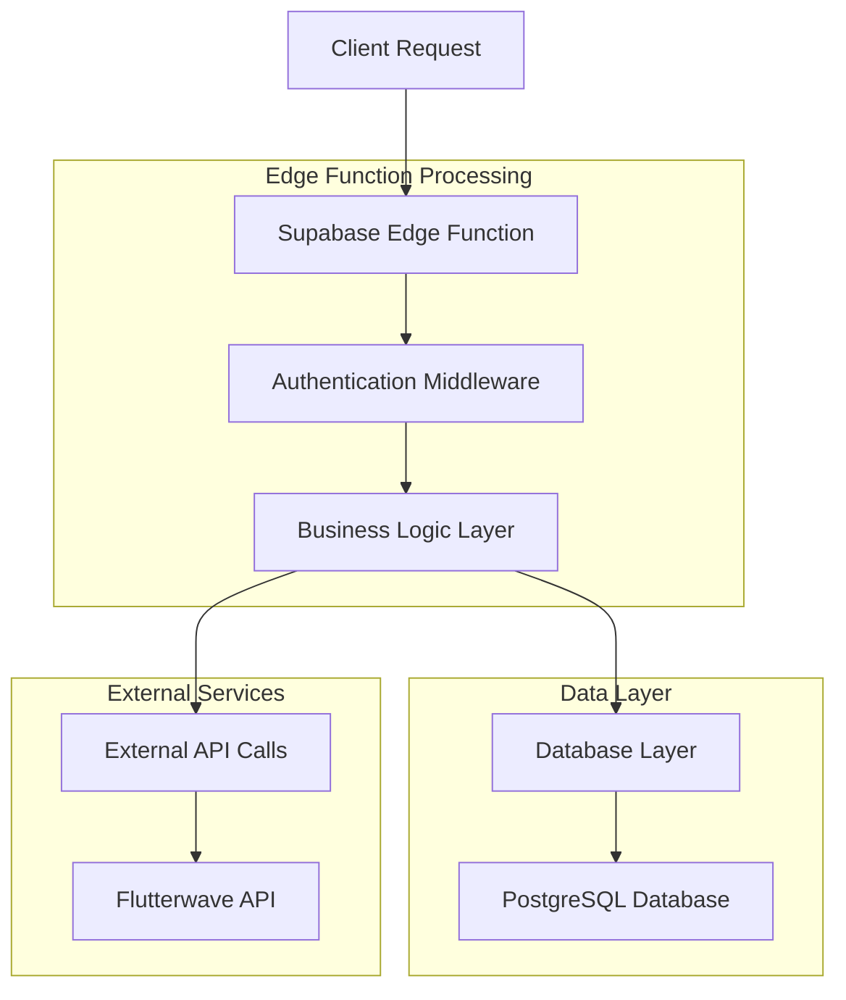
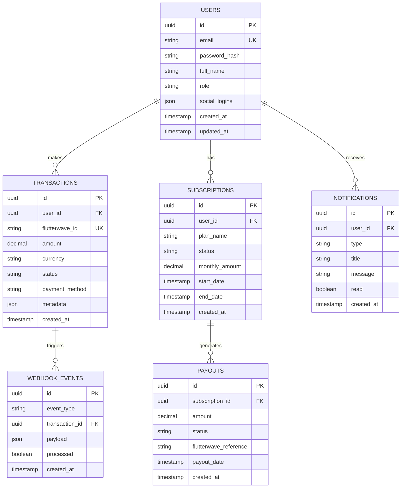

## 1. Architecture Design



## 2. Technology Description
- **Frontend**: React@18 + TailwindCSS@3 + Vite@5
- **Backend**: Supabase (PostgreSQL, Authentication, Edge Functions)
- **Payment Gateway**: Flutterwave Web SDK
- **UI Components**: Headless UI, TanStack Table, Recharts
- **Forms**: React Hook Form with Zod validation
- **Notifications**: react-hot-toast
- **Deployment**: Render (frontend + edge functions)

## 3. Route Definitions
| Route | Purpose |
|-------|---------|
| / | Landing page with hero section and feature highlights |
| /pricing | Subscription tiers and pricing comparison |
| /contact | Support form and help center |
| /compliance | Security certifications and regulatory information |
| /reports | Transaction history and analytics dashboard |
| /dashboard | User dashboard with transaction overview |
| /admin | Admin dashboard with system analytics |
| /login | Authentication page with social login options |
| /register | User registration with email/social signup |
| /profile | User profile and settings management |

## 4. API Definitions

### 4.1 Authentication APIs
```
POST /auth/v1/token
```
Request:
| Param Name | Param Type | isRequired | Description |
|------------|------------|------------|-------------|
| email | string | true | User email address |
| password | string | true | User password |

Response:
| Param Name | Param Type | Description |
|------------|------------|-------------|
| access_token | string | JWT access token (15min) |
| refresh_token | string | JWT refresh token (30 days) |
| user | object | User profile data |

### 4.2 Payment APIs
```
POST /functions/v1/process-payment
```
Request:
| Param Name | Param Type | isRequired | Description |
|------------|------------|------------|-------------|
| amount | number | true | Payment amount in NGN |
| currency | string | true | Currency code (NGN/USD) |
| payment_method | string | true | card, bank_transfer, mpesa, momo |
| subscription_id | string | false | For subscription payments |

Response:
| Param Name | Param Type | Description |
|------------|------------|-------------|
| transaction_id | string | Flutterwave transaction ID |
| status | string | successful, pending, failed |
| amount | number | Processed amount |

### 4.3 Webhook APIs
```
POST /functions/v1/webhook/flutterwave
```
Headers:
| Header Name | Description |
|-------------|-------------|
| verif-hash | Flutterwave signature for verification |

Request Body:
```json
{
  "event": "charge.completed",
  "data": {
    "id": "transaction_id",
    "status": "successful",
    "amount": 1000,
    "currency": "NGN"
  }
}
```

## 5. Server Architecture Diagram



## 6. Data Model

### 6.1 Database Schema


### 6.2 Data Definition Language

**Users Table**
```sql
-- Create users table
CREATE TABLE users (
  id UUID PRIMARY KEY DEFAULT gen_random_uuid(),
  email VARCHAR(255) UNIQUE NOT NULL,
  password_hash VARCHAR(255),
  full_name VARCHAR(255) NOT NULL,
  role VARCHAR(20) DEFAULT 'user' CHECK (role IN ('user', 'admin')),
  social_logins JSONB DEFAULT '{}',
  created_at TIMESTAMP WITH TIME ZONE DEFAULT NOW(),
  updated_at TIMESTAMP WITH TIME ZONE DEFAULT NOW()
);

-- Create index for email lookups
CREATE INDEX idx_users_email ON users(email);
CREATE INDEX idx_users_role ON users(role);

-- Grant permissions
GRANT SELECT ON users TO anon;
GRANT ALL PRIVILEGES ON users TO authenticated;
```

**Transactions Table**
```sql
-- Create transactions table
CREATE TABLE transactions (
  id UUID PRIMARY KEY DEFAULT gen_random_uuid(),
  user_id UUID REFERENCES users(id) ON DELETE CASCADE,
  flutterwave_id VARCHAR(255) UNIQUE,
  amount DECIMAL(10,2) NOT NULL,
  currency VARCHAR(3) NOT NULL DEFAULT 'NGN',
  status VARCHAR(20) NOT NULL CHECK (status IN ('pending', 'successful', 'failed', 'refunded')),
  payment_method VARCHAR(50) NOT NULL,
  metadata JSONB DEFAULT '{}',
  created_at TIMESTAMP WITH TIME ZONE DEFAULT NOW()
);

-- Create indexes
CREATE INDEX idx_transactions_user_id ON transactions(user_id);
CREATE INDEX idx_transactions_flutterwave_id ON transactions(flutterwave_id);
CREATE INDEX idx_transactions_status ON transactions(status);
CREATE INDEX idx_transactions_created_at ON transactions(created_at DESC);

-- Grant permissions
GRANT SELECT ON transactions TO anon;
GRANT ALL PRIVILEGES ON transactions TO authenticated;
```

**Subscriptions Table**
```sql
-- Create subscriptions table
CREATE TABLE subscriptions (
  id UUID PRIMARY KEY DEFAULT gen_random_uuid(),
  user_id UUID REFERENCES users(id) ON DELETE CASCADE,
  plan_name VARCHAR(100) NOT NULL,
  status VARCHAR(20) NOT NULL CHECK (status IN ('active', 'cancelled', 'expired', 'pending')),
  monthly_amount DECIMAL(10,2) NOT NULL,
  start_date TIMESTAMP WITH TIME ZONE,
  end_date TIMESTAMP WITH TIME ZONE,
  created_at TIMESTAMP WITH TIME ZONE DEFAULT NOW()
);

-- Create indexes
CREATE INDEX idx_subscriptions_user_id ON subscriptions(user_id);
CREATE INDEX idx_subscriptions_status ON subscriptions(status);
CREATE INDEX idx_subscriptions_end_date ON subscriptions(end_date);

-- Grant permissions
GRANT SELECT ON subscriptions TO anon;
GRANT ALL PRIVILEGES ON subscriptions TO authenticated;
```

**Webhook Events Table**
```sql
-- Create webhook events table
CREATE TABLE webhook_events (
  id UUID PRIMARY KEY DEFAULT gen_random_uuid(),
  event_type VARCHAR(100) NOT NULL,
  transaction_id UUID REFERENCES transactions(id),
  payload JSONB NOT NULL,
  processed BOOLEAN DEFAULT FALSE,
  created_at TIMESTAMP WITH TIME ZONE DEFAULT NOW()
);

-- Create indexes
CREATE INDEX idx_webhook_events_type ON webhook_events(event_type);
CREATE INDEX idx_webhook_events_processed ON webhook_events(processed);
CREATE INDEX idx_webhook_events_created_at ON webhook_events(created_at DESC);

-- Grant permissions
GRANT SELECT ON webhook_events TO anon;
GRANT ALL PRIVILEGES ON webhook_events TO authenticated;
```

**Notifications Table**
```sql
-- Create notifications table
CREATE TABLE notifications (
  id UUID PRIMARY KEY DEFAULT gen_random_uuid(),
  user_id UUID REFERENCES users(id) ON DELETE CASCADE,
  type VARCHAR(50) NOT NULL,
  title VARCHAR(255) NOT NULL,
  message TEXT NOT NULL,
  read BOOLEAN DEFAULT FALSE,
  created_at TIMESTAMP WITH TIME ZONE DEFAULT NOW()
);

-- Create indexes
CREATE INDEX idx_notifications_user_id ON notifications(user_id);
CREATE INDEX idx_notifications_read ON notifications(read);
CREATE INDEX idx_notifications_created_at ON notifications(created_at DESC);

-- Grant permissions
GRANT SELECT ON notifications TO anon;
GRANT ALL PRIVILEGES ON notifications TO authenticated;
```

**Audit Logs Table**
```sql
-- Create audit logs table
CREATE TABLE audit_logs (
  id UUID PRIMARY KEY DEFAULT gen_random_uuid(),
  user_id UUID REFERENCES users(id),
  action VARCHAR(100) NOT NULL,
  resource_type VARCHAR(50) NOT NULL,
  resource_id VARCHAR(255),
  changes JSONB DEFAULT '{}',
  ip_address INET,
  user_agent TEXT,
  created_at TIMESTAMP WITH TIME ZONE DEFAULT NOW()
);

-- Create indexes
CREATE INDEX idx_audit_logs_user_id ON audit_logs(user_id);
CREATE INDEX idx_audit_logs_action ON audit_logs(action);
CREATE INDEX idx_audit_logs_created_at ON audit_logs(created_at DESC);

-- Grant permissions
GRANT SELECT ON audit_logs TO authenticated;
```

**Row Level Security Policies**
```sql
-- Users can only see their own data
CREATE POLICY "Users can view own profile" ON users
  FOR SELECT USING (auth.uid() = id);

CREATE POLICY "Users can update own profile" ON users
  FOR UPDATE USING (auth.uid() = id);

-- Transactions visibility
CREATE POLICY "Users can view own transactions" ON transactions
  FOR SELECT USING (auth.uid() = user_id);

-- Subscriptions visibility
CREATE POLICY "Users can view own subscriptions" ON subscriptions
  FOR SELECT USING (auth.uid() = user_id);

-- Notifications visibility
CREATE POLICY "Users can view own notifications" ON notifications
  FOR SELECT USING (auth.uid() = user_id);

CREATE POLICY "Users can update own notifications" ON notifications
  FOR UPDATE USING (auth.uid() = user_id);

-- Admin policies
CREATE POLICY "Admins can view all users" ON users
  FOR SELECT USING (EXISTS (
    SELECT 1 FROM users WHERE id = auth.uid() AND role = 'admin'
  ));
```